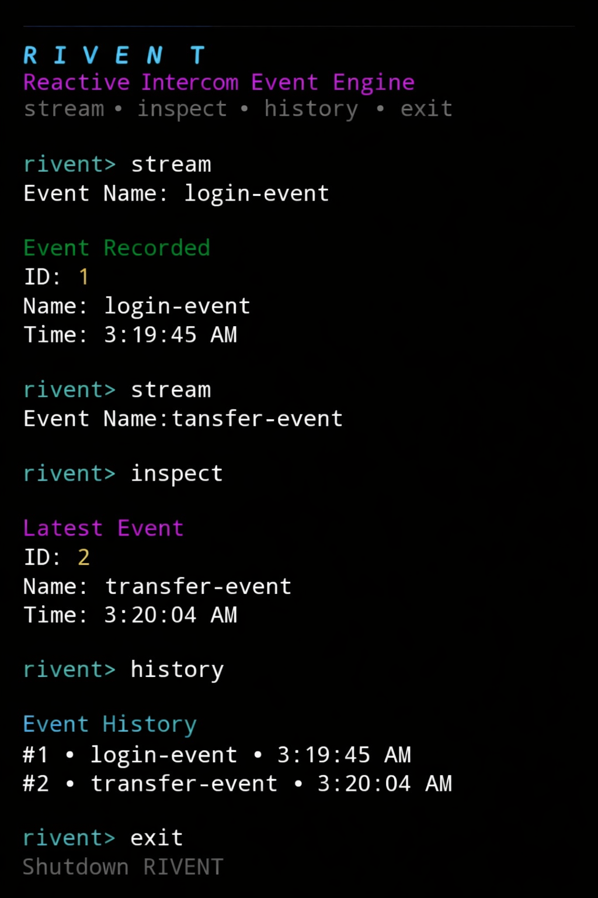

# RIVENT

Reactive Intercom Event Engine built on top of the Intercom-Swap stack.

RIVENT is a CLI-based event stream simulation engine designed to demonstrate structured event processing, state tracking, and reactive command flow inside a terminal environment.

---

## Overview

RIVENT simulates a lightweight reactive event system where events can be streamed, inspected, and reviewed through a clean terminal interface.

This project extends the Intercom architecture with a custom CLI workflow and structured event lifecycle handling.

---

## Core Features

- Event streaming system
- Real-time timestamp generation
- Stateful event memory
- Latest event inspection
- Event history logging
- Clean modular CLI interaction
- Execution preview included

---

## Command List

Available commands inside the application:

- stream  
- inspect  
- history  
- exit  

---

## Execution Flow

1. Start the engine
2. Stream event input
3. Store event in memory
4. Inspect latest event snapshot
5. Review full event history
6. Shutdown safely

---

## Installation

```bash
git clone https://github.com/amri72/rivent
cd rivent
npm install
node index.js
```

---

## Architecture

RIVENT demonstrates:

- CLI interaction layer
- Reactive event handling
- In-memory state tracking
- Structured output formatting
- Modular command routing
- Intercom-based extension

---

## Project Structure

```
rivent/
│
├── index.js
├── package.json
├── proof/
│   └── preview.png
├── README.md
└── SKILL.md
```

---

## Preview



---

## Proof of Execution

The preview demonstrates:

- Event streaming interaction
- Event ID generation
- Timestamp validation
- Latest event inspection
- Event history rendering
- Clean shutdown sequence

---

## Trac Wallet

```
trac1hf2lxjy0rral53le9mztxh8gazrakvm6rpqlmscuyua6ap4swujsk6pxjf
```

---

## Intercom Reference

This repository is built as a modified fork of the Intercom-Swap stack and includes structural changes to CLI behavior, event management logic, and documentation updates.

---

## Status

Active fork with custom implementation and execution preview included.
